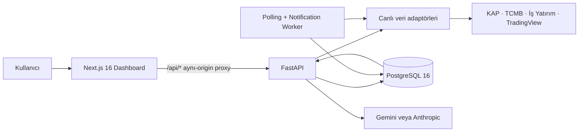

<div align="center">

# Hisse Analizi Dashboard

**Borsa İstanbul için canlı piyasa verisi, teknik ve temel analiz, makro göstergeler, KAP/haber akışı ve açıklanabilir AI raporlarını tek ekranda birleştiren full-stack analiz platformu.**

[](https://github.com/bugraguclu/hisse-analizi-dashboard/actions/workflows/ci.yml)
[](https://www.python.org/)
[](https://fastapi.tiangolo.com/)
[](https://nextjs.org/)
[](https://www.postgresql.org/)
[](./CHANGELOG.md)

[Hızlı başlangıç](#hızlı-başlangıç) · [Özellikler](#uygulamada-neler-var) · [Mimari](#mimari) · [API](#api) · [Yayınlama](#yayınlama)

</div>

> [!IMPORTANT]
> Bu uygulama yatırım danışmanlığı hizmeti vermez. Gösterilen veriler ve AI çıktıları yalnızca araştırma/karar desteği amacıyla sunulur; yatırım kararı vermeden önce birincil kaynakları doğrulayın.

## Uygulamada neler var?

| Bölüm | İçerik |
|---|---|
| Piyasa özeti | BIST 100 grafiği, ana endeksler, gün içi OHLCV, piyasa durumu ve takip listesi |
| Hisse analizi | Fiyat/hacim grafikleri, canlı oranlar, KAP açıklamaları, finansal tablolar, temettü, ortaklık ve analist hedefleri |
| Teknik analiz | RSI, MACD, Bollinger, SMA/EMA, hareketli ortalamalar, pivotlar, SuperTrend ve Stochastic |
| Çoklu zaman dilimi | Dokuz zaman diliminde AL/SAT/NÖTR teknik sinyal özeti |
| Temel analiz | Şirket profili, piyasa değeri, F/K, PD/DD, finansal sağlık, risk skorları ve 52 hafta aralığı |
| Kombine analiz | Teknik ve temel verilerin tek ekranda karşılaştırılması |
| Hisse tarama | İşlem gören BIST payları, hazır temel filtreler ve teknik sinyal tarayıcısı |
| Makro ekonomi | TCMB faizleri, politika faizi, enflasyon, döviz kurları ve ekonomik takvim |
| Olaylar ve haberler | Worker tarafından toplanan KAP/kurumsal olay arşivi ile hisse bazlı haber akışı |
| AI analiz raporu | Teknik, temel, fiyat, KAP, haber ve makro kanıtları birleştiren; önbellekli ve SSE ile akış destekli Türkçe rapor |

Arayüz Türkçe/İngilizce dil desteği, koyu/açık tema, mobil uyumlu yerleşim, belirgin yükleme/hata durumları ve aynı-origin API proxy’si içerir.

## Veri doğruluğu yaklaşımı

Uygulama, eksik veriyi sessizce `0` olarak göstermek yerine kaynak hatasını kullanıcıya taşır. Dönem, sunum birimi ve kaynak bilgisi mümkün olan ekranlarda görünür tutulur.

| Veri grubu | Birincil kaynak | Uygulanan kontrol |
|---|---|---|
| Bilanço ve gelir tablosu | Resmî KAP finansal tabloları | Dönem/sunum birimi ayrıştırma, TL normalizasyonu, yıllık ve ara dönem ayrımı |
| Nakit akışı, temettü, ortaklık | İş Yatırım (`borsapy`) | Alan adı normalizasyonu, tarih sıralama ve boş değer kontrolü |
| Fiyat, endeks, teknik göstergeler | Borsa İstanbul/TradingView (`borsapy`) | Periyot eşleme, önceki kapanıştan değişim kontrolü ve geçersiz hacim eleme |
| Tarama ve sembol arama | İş Yatırım/TradingView (`borsapy`) | Yalnızca BIST’te işlem gören pay evreni ve filtre sözleşmesi doğrulaması |
| Analist beklentileri | İş Yatırım/Hedef Fiyat konsensüsü (`borsapy`) | Güncel fiyat, hedef aralığı, medyan/ortalama ve analist sayısını ayrı sunma |
| Politika faizi ve döviz | TCMB (`borsapy`) | En güncel kayıt seçimi, resmî tarih ve kur türü gösterimi |
| Enflasyon | TÜİK verisi, TCMB tablosu üzerinden | En son dönemin tarihe göre seçilmesi; aylık/yıllık oran ayrımı |
| KAP olayları ve haberler | KAP, Google News RSS | URL/tarih normalizasyonu, içerik bazlı tekilleştirme ve kaynak bağlantısı |

Veri sözleşmelerini koruyan regresyon testleri `tests/unit/test_*_data_quality.py` dosyalarındadır. Ayrıntılı ürün ve doğrulama özeti için [Yönetici Özeti](./PROJE_OZETI.md) belgesine bakın.

## Mimari



- **Dashboard:** Next.js App Router, React 19, TypeScript, Tailwind CSS, Recharts ve TanStack Query.
- **API:** Async FastAPI, Pydantic, rate limiting, CORS allowlist ve `X-Admin-Key` korumalı yönetim endpoint’leri.
- **Veri katmanı:** SQLAlchemy 2.x, async PostgreSQL, Alembic migration’ları, atomik upsert ve outbox işleme.
- **Worker:** API prosesinden bağımsız veri toplama, advisory lock, sınırlı eşzamanlılık ve bildirim kuyruğu.
- **AI:** Sağlayıcı seçimi, günlük maliyet sınırı, içerik hash’i ile generate-once cache ve SSE streaming.

Daha ayrıntılı bileşen/veri akışı için [Mimari Dokümanı](./docs/mimari.md) kullanılabilir.

## Hızlı başlangıç

### Gereksinimler

- Git
- Docker Engine/Desktop ve Docker Compose v2
- Geliştirme için isteğe bağlı: Python 3.11+ ve Node.js 20+

### Docker ile tüm sistemi çalıştırma

```bash
git clone https://github.com/bugraguclu/hisse-analizi-dashboard.git
cd hisse-analizi-dashboard

cp .env.example .env
docker compose up --build -d
docker compose exec app alembic upgrade head
docker compose exec app python scripts/seed.py
```

| Servis | Adres |
|---|---|
| Web dashboard | http://localhost:3000 |
| FastAPI | http://localhost:8000 |
| Swagger UI | http://localhost:8000/docs |
| Health check | http://localhost:8000/health |
| MailHog (isteğe bağlı) | `docker compose --profile mail up -d mailhog` → http://localhost:8025 |

Servis durumlarını kontrol etmek için:

```bash
docker compose ps
docker compose logs -f app worker dashboard
```

### Yerel geliştirme

PostgreSQL’i çalıştırdıktan ve `.env` dosyasını hazırladıktan sonra backend:

```bash
python -m venv .venv
source .venv/bin/activate
python -m pip install -e ".[dev,email]"
alembic upgrade head
python scripts/seed.py
uvicorn src.api.app:app --reload
```

Ayrı terminalde frontend:

```bash
cd dashboard
cp .env.example .env.local
npm ci
npm run dev
```

## Yapılandırma

Tam şablon [`.env.example`](./.env.example) dosyasındadır. Gizli değerleri repoya commit etmeyin.

| Değişken | Amaç | Gereklilik |
|---|---|---|
| `APP_ENV` | `development`, `staging` veya `production` çalışma modu | Varsayılan: `development` |
| `DATABASE_URL` | Async PostgreSQL bağlantısı | Evet |
| `DATABASE_URL_SYNC` | Alembic/senkron işler için PostgreSQL bağlantısı | Evet |
| `ADMIN_API_KEY` | `/admin/*` endpoint’lerini korur | Staging/production’da zorunlu |
| `CORS_ORIGINS` | Virgülle ayrılmış izinli origin listesi | Production’da açıkça ayarlayın |
| `GEMINI_API_KEY` | Gemini raporları ve isteğe bağlı haber sınıflandırma | AI için isteğe bağlı |
| `ANTHROPIC_API_KEY` | Alternatif Anthropic sağlayıcısı | AI için isteğe bağlı |
| `AI_DAILY_BUDGET_USD` | Günlük LLM maliyet devre kesicisi | Varsayılan: `5.0` |
| `NEWS_POLL_ENABLED` | Haber worker’ını açar/kapatır | Varsayılan: `true` |
| `SMTP_*` / `ENABLE_REAL_EMAIL` | Gerçek e-posta gönderimi | Bildirimler için isteğe bağlı |
| `API_URL` | Next.js sunucusunun erişeceği dahili FastAPI adresi | Dashboard deployment’ında gerekli |

AI anahtarı tanımlanmazsa platformun piyasa/analiz bölümleri çalışmaya devam eder; `/ai/*` çağrıları açıklayıcı `503` yanıtı verir.

## API

FastAPI, çalışırken OpenAPI sözleşmesini otomatik üretir:

- Swagger UI: `GET /docs`
- ReDoc: `GET /redoc`
- OpenAPI JSON: `GET /openapi.json`

Ana endpoint grupları:

| Grup | Örnekler |
|---|---|
| Sistem ve arşiv | `/health`, `/stats`, `/events`, `/prices`, `/financials` |
| Teknik analiz | `/technical/{ticker}/rsi`, `/technical/{ticker}/signals`, `/technical/{ticker}/pivots` |
| Temel analiz | `/fundamentals/{ticker}/balance-sheet`, `/fundamentals/{ticker}/live-ratios` |
| Piyasa | `/market/screener`, `/market/scanner`, `/market/indices`, `/market/snapshot` |
| Makro | `/macro/policy-rate`, `/macro/inflation`, `/macro/fx/{currency}` |
| Haber ve AI | `/news/{ticker}`, `/ai/status`, `/ai/report/{ticker}/stream` |
| Yönetim | `/admin/poll/run-once`, `/admin/backfill`, `/admin/notifications/test-send` |

Parametreler ve örnek yanıtlar için [API Kullanım Rehberi](./docs/api-rehberi.md) veya çalışan Swagger arayüzünü kullanın.

## Kalite kontrolleri

```bash
# Backend
.venv/bin/ruff check src tests
.venv/bin/pytest -q

# Frontend
cd dashboard
npm run lint -- --max-warnings=0
npm run build
npm audit --audit-level=high

# Deployment sözleşmesi
docker compose config --quiet
```

Son kapsamlı yerel doğrulamada **91 test** (canlı upstream smoke testleri dâhil), Python lint, frontend lint, TypeScript/Next.js production build, npm güvenlik taraması ve Compose yapılandırma kontrolü başarıyla tamamlandı. Ana GitHub Actions akışı deterministik kontrolleri her push/pull request’te; ayrı live-data akışı dış veri sözleşmelerini hafta içi zamanlanmış olarak tekrarlar.

## Yayınlama

Production yayını öncesinde:

1. `.env.example` üzerinden güçlü PostgreSQL parolaları, `ADMIN_API_KEY`, `CORS_ORIGINS` ve gerekli sağlayıcı secret’larını tanımlayın.
2. `APP_ENV=production` kullanın; secret’ları image içine değil deployment platformunun secret yöneticisine verin.
3. `alembic upgrade head` ve `python scripts/seed.py` adımlarını çalıştırın.
4. Tek worker ile başlayın; ölçekleme kararını advisory lock/outbox davranışını izleyerek verin.
5. `/health`, `/api/health`, veri sağlayıcıları ve DB’ye bağlı `/stats`, `/events`, `/news` akışlarını smoke test edin.
6. TLS, reverse proxy güvenlik başlıkları, PostgreSQL yedekleme ve hata/uptime izlemeyi platform katmanında etkinleştirin.

`docker-compose.override.yml` geliştirme mount’ları içerir. Production ortamında yalnızca ana Compose dosyasını kullanmak için `docker compose -f docker-compose.yml ...` komutunu tercih edin.

## Proje yapısı

```text
.
├── dashboard/           # Next.js web arayüzü
├── src/
│   ├── adapters/        # Haricî veri ve LLM bağlantıları
│   ├── api/             # FastAPI uygulaması ve router’lar
│   ├── core/            # Ayarlar, loglama ve ortak sabitler
│   ├── db/              # SQLAlchemy modelleri/repository’ler
│   ├── services/        # İş kuralları, AI ve bildirim servisleri
│   └── workers/         # Polling, haber, AI ve notification worker’ları
├── alembic/             # PostgreSQL migration’ları
├── tests/               # Unit, integration ve veri kalite testleri
├── scripts/             # Seed, backfill ve operasyon araçları
├── docs/                # Mimari, API ve yol haritası
└── docker-compose.yml   # Uygulama servisleri
```

## Dokümantasyon

- [Yönetici Özeti](./PROJE_OZETI.md)
- [Mimari](./docs/mimari.md)
- [API Rehberi](./docs/api-rehberi.md)
- [Yol Haritası](./docs/ROADMAP.md)
- [Değişiklik Günlüğü](./CHANGELOG.md)
- [Katkı Rehberi](./CONTRIBUTING.md)
- [Güvenlik Politikası](./SECURITY.md)

## Sınırlar

- Haricî sağlayıcıların API/HTML sözleşmeleri değiştiğinde adaptör güncellemesi gerekebilir.
- KAP, haber arşivi, sistem sayaçları ve AI rapor cache’i PostgreSQL + worker servislerine bağlıdır.
- Sosyal medya endpoint’i sağlayıcı kimlik doğrulaması olmadan kullanıma hazır değildir ve yayın arayüzünde gösterilmez.
- Gerçek zamanlı borsa terminali değildir; sağlayıcı gecikmeleri ve cache süreleri uygulanır.

## Katkı ve lisans

Katkılar pull request üzerinden kabul edilir; başlamadan önce [CONTRIBUTING.md](./CONTRIBUTING.md) içindeki kalite ve commit kurallarını okuyun. Güvenlik açıklarını public issue olarak paylaşmayın; [SECURITY.md](./SECURITY.md) sürecini izleyin.

Bu depoda şu anda açık kaynak lisansı tanımlanmamıştır. Bir lisans eklenene kadar kaynak kodun yeniden kullanımı veya dağıtımı için depo sahibinden izin alınmalıdır.
