# Hisse Analizi

[](https://github.com/bugraguclu/hisse-analizi-dashboard/actions/workflows/ci.yml)
[](https://hisse-analizi.duckdns.org)

Borsa İstanbul için piyasa takibi ve hisse analizi uygulaması: piyasa özeti, etkileşimli grafikler, teknik ve temel analiz, KAP bildirimleri, makroekonomik veriler ve hisse taraması. Next.js ile yazılmış arayüzün arkasında FastAPI, PostgreSQL ve verileri kaynaklardan düzenli olarak toplayan ayrı bir worker süreci çalışır.

**Canlı:** [hisse-analizi.duckdns.org](https://hisse-analizi.duckdns.org) · [Ekran görüntüleri](#ekran-görüntüleri) · [Kurulum](#kurulum) · [Sunucuya kurulum](#sunucuya-kurulum) · [Mimari](#mimari) · [API](#api) · [Değişiklik günlüğü](./CHANGELOG.md)

<a href="https://hisse-analizi.duckdns.org">
  <picture>
    <source media="(prefers-color-scheme: dark)" srcset="docs/images/overview-dark.webp">
    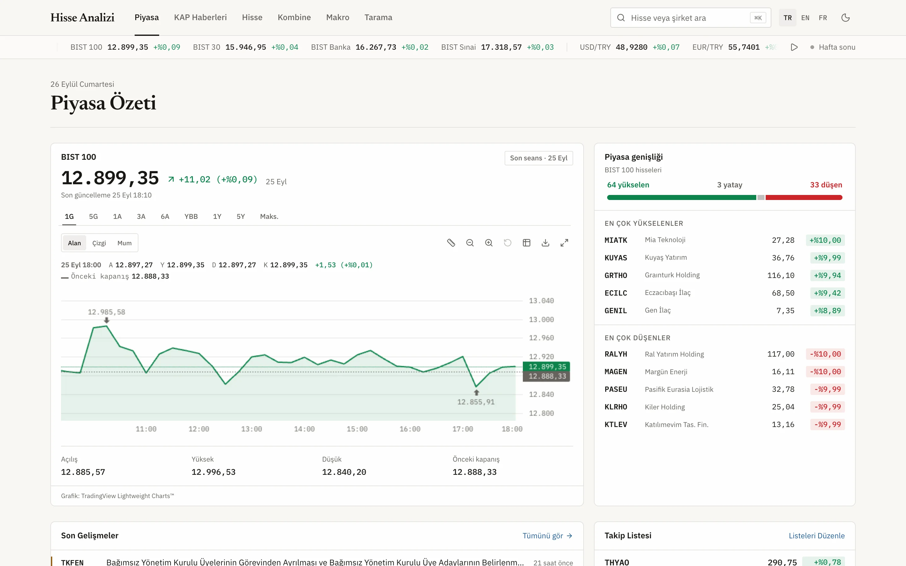
  </picture>
</a>

> Yatırım tavsiyesi değildir. Veriler karar desteği amacıyla sunulur; yatırım kararı öncesinde birincil kaynaktan doğrulanmalıdır.

## Canlı sürüm

[hisse-analizi.duckdns.org](https://hisse-analizi.duckdns.org) bu depodaki üretim yapılandırmasıyla çalışır. Hesap açmak gerekmez.

- Worker verileri sürekli toplar: KAP bildirimleri dakikada bir, haberler 15 dakikada bir, kotasyonlar seans boyunca dakikada bir güncellenir. Fiyatlar kaynağında 15 dakika gecikmelidir.
- Sunucu Oracle Cloud Always Free üzerindedir (Ampere A1, 4 çekirdek, 24 GB bellek). Alan adı DuckDNS'in ücretsiz alt alan adıdır; HTTPS sertifikasını Caddy, Let's Encrypt'ten alır ve yeniler.
- Veritabanı her gece yedeklenir, yedekler 14 gün saklanır.
- Aynı kurulum, [Sunucuya kurulum](#sunucuya-kurulum) bölümündeki betikle başka bir sunucuda tekrarlanabilir.

## Özellikler

| Bölüm | İçerik |
|---|---|
| **Piyasa özeti** | BIST 100 grafiği (gün içi ve dönemsel), piyasa genişliği (yükselen, yatay, düşen), günün en çok yükselen ve düşen hisseleri, son KAP gelişmeleri, takip listeleri |
| **Hisse sayfası** | 15 dakika gecikmeli fiyat ve günlük değişim; piyasa istatistikleri (F/K, PD/DD, halka açıklık, yabancı payı, 52 haftalık aralık); son 12 ay (TTM) oranları; nasıl hesaplandığı açıklanan analiz karnesi; KAP bildirimleri; haberler (BIST 100 şirketleri); analist hedefleri; finansal tablolar; temettü ve finansal rapor takvimi |
| **Grafikler** | Alan, çizgi ve mum grafik; hacim, SMA 20/50/200, Bollinger, RSI, MACD ve Stokastik; XU100 ile getiri karşılaştırması; cetvelle ya da Shift ile sürükleyerek ölçüm, yakınlaştırma, veri tablosu, PNG ve tam ekran; klavye ve ekran okuyucu desteği |
| **Teknik analiz** | RSI, MACD, Bollinger, SuperTrend, Stokastik; SMA/EMA tablosu ve altın/ölüm kesişimi; klasik pivot seviyeleri; dokuz zaman diliminde (1 dakikadan 1 aya) TradingView özeti |
| **Temel analiz** | Bilanço, gelir ve nakit akışı tabloları (yıllık veya ara dönem, kümülatif veya çeyreklik, birimi belirtilmiş); F/K, PD/DD, F/S, FD/FAVÖK; şirket profili ve ortaklık yapısı |
| **Kombine** | Teknik ve temel görünüm yan yana: teknik özet ve göstergeler, analist önerisi ve konsensüs hedef fiyat, analiz karnesi, oranlar, ortaklık yapısı |
| **Makroekonomi** | TCMB politika faizi, faiz koridoru ve PPK takvimi; reel faiz; TÜFE/ÜFE; büyüme ve istihdam; dış denge, rezervler, bütçe dengesi ve kamu borcu; tahvil getiri eğrisi, döviz, altın ve emtia grafikleri; TCMB gösterge kurları |
| **Ekonomik takvim** | Türkiye ve yurt dışı veri açıklamaları: gerçekleşen, tahmin ve önceki değer; önem, ülke ve konu filtreleri; arama; CSV ve `.ics` dışa aktarma |
| **Hisse tarama** | ~630 BIST payı; değerleme, kârlılık, ölçek, teknik, performans ve analist kriterleri; 31 hazır tarama; endeks ve sektör filtreleri; beş sütun görünümü; sıralama ve CSV dışa aktarma |
| **KAP haberleri** | Günlere göre gruplanan bildirim akışı; tarih, önem, kategori, hisse ve takip listesi filtreleri; arama ve dört sıralama; bildirimin tablolarıyla tam metni, `j`/`k` ile önceki ve sonraki bildirim |
| **Her sayfada** | Piyasa şeridi (BIST 100/30/Banka/Sınai, USD ve EUR, gram ve ons altın, Brent, 2 ve 10 yıllık tahvil faizi, seans durumu); `⌘K` ile hisse arama; Türkçe, İngilizce ve Fransızca; açık ve koyu tema; telefon uyumu; tarama, KAP ve takvim filtreleri URL'de saklanır ve bağlantıyla paylaşılabilir |

Eksik veri hiçbir ekranda `0` olarak gösterilmez: değer yoksa `—` yazılır; yükleniyor, boş veri ve kaynak hatası durumları ayrı gösterilir.

## Ekran görüntüleri

Görüntüler 26 Eylül 2026'da canlı siteden alındı. GitHub'ı koyu temada kullanıyorsanız koyu tema görüntüleri gösterilir; bir görüntüye tıklamak canlı sitedeki sayfayı açar.

<table>
  <tr>
    <td width="50%" valign="top">
      <a href="https://hisse-analizi.duckdns.org/hisse/THYAO">
        <picture>
          <source media="(prefers-color-scheme: dark)" srcset="docs/images/stock-dark.webp">
          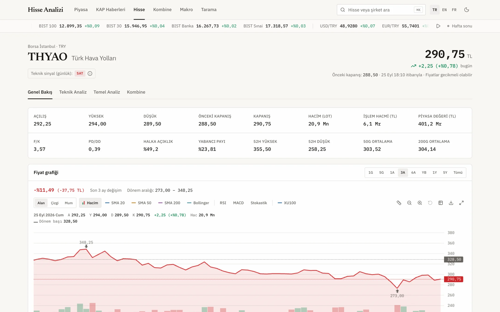
        </picture>
      </a>
      <p align="center"><sub>Hisse sayfası: fiyat, piyasa istatistikleri ve grafik</sub></p>
    </td>
    <td width="50%" valign="top">
      <a href="https://hisse-analizi.duckdns.org/teknik/THYAO">
        <picture>
          <source media="(prefers-color-scheme: dark)" srcset="docs/images/chart-dark.webp">
          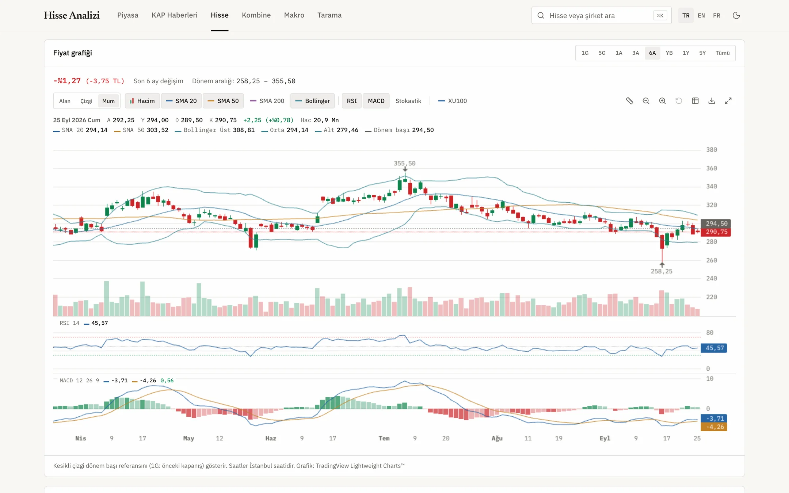
        </picture>
      </a>
      <p align="center"><sub>Grafik: mum, hacim, SMA, Bollinger, RSI ve MACD</sub></p>
    </td>
  </tr>
  <tr>
    <td width="50%" valign="top">
      <a href="https://hisse-analizi.duckdns.org/temel/THYAO">
        <picture>
          <source media="(prefers-color-scheme: dark)" srcset="docs/images/fundamentals-dark.webp">
          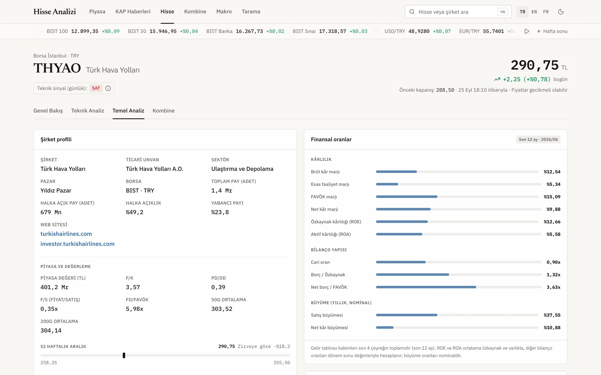
        </picture>
      </a>
      <p align="center"><sub>Temel analiz: şirket profili, değerleme ve finansal oranlar</sub></p>
    </td>
    <td width="50%" valign="top">
      <a href="https://hisse-analizi.duckdns.org/analiz/THYAO">
        <picture>
          <source media="(prefers-color-scheme: dark)" srcset="docs/images/analysis-dark.webp">
          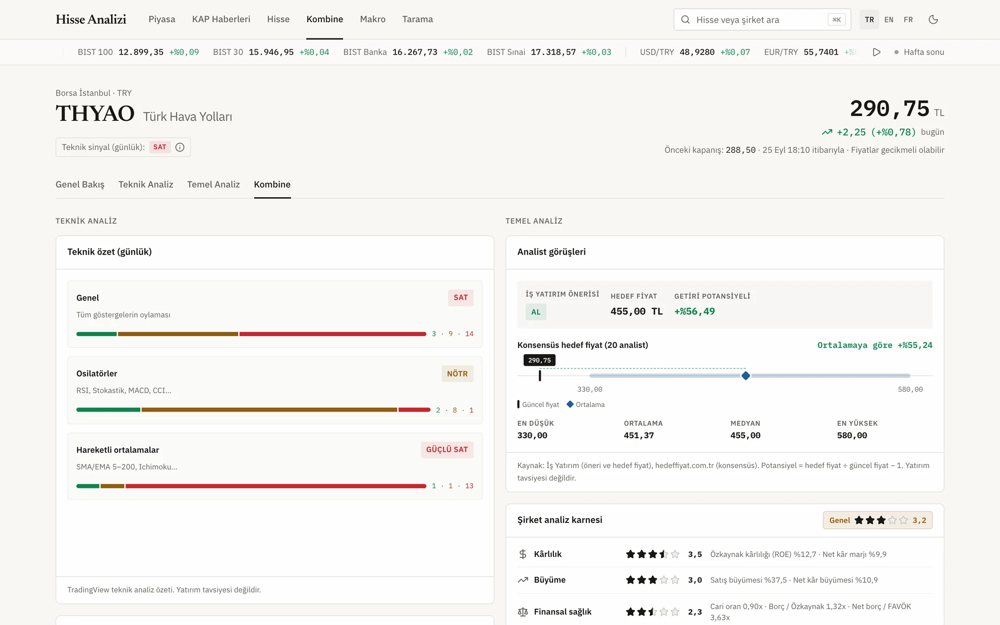
        </picture>
      </a>
      <p align="center"><sub>Kombine: teknik özet, analist hedefleri ve analiz karnesi</sub></p>
    </td>
  </tr>
  <tr>
    <td width="50%" valign="top">
      <a href="https://hisse-analizi.duckdns.org/tarama">
        <picture>
          <source media="(prefers-color-scheme: dark)" srcset="docs/images/screener-dark.webp">
          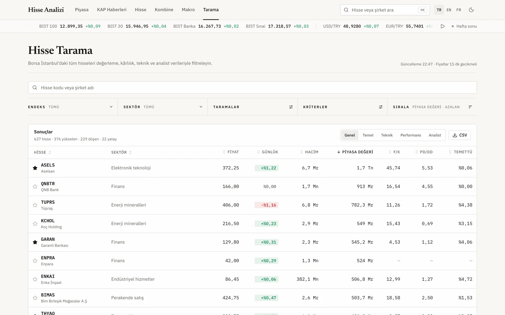
        </picture>
      </a>
      <p align="center"><sub>Hisse tarama: 31 hazır tarama ve kriter filtreleri</sub></p>
    </td>
    <td width="50%" valign="top">
      <a href="https://hisse-analizi.duckdns.org/makro">
        <picture>
          <source media="(prefers-color-scheme: dark)" srcset="docs/images/macro-dark.webp">
          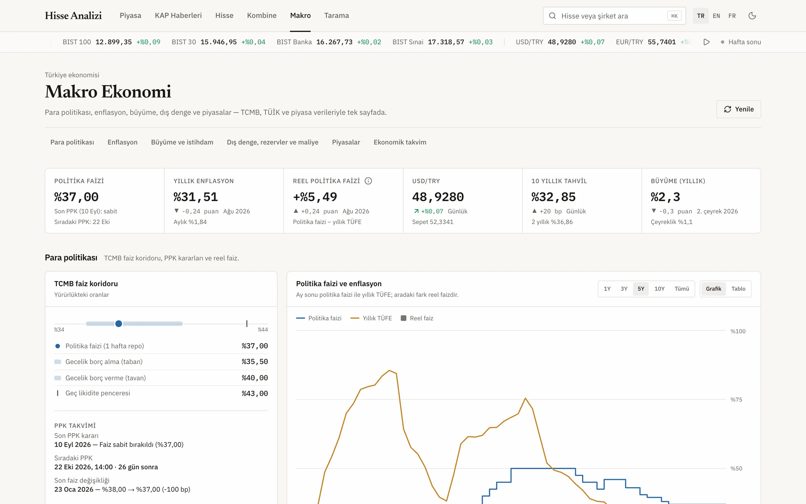
        </picture>
      </a>
      <p align="center"><sub>Makroekonomi: faiz koridoru, enflasyon ve reel faiz</sub></p>
    </td>
  </tr>
  <tr>
    <td width="50%" valign="top">
      <a href="https://hisse-analizi.duckdns.org/makro#takvim">
        <picture>
          <source media="(prefers-color-scheme: dark)" srcset="docs/images/calendar-dark.webp">
          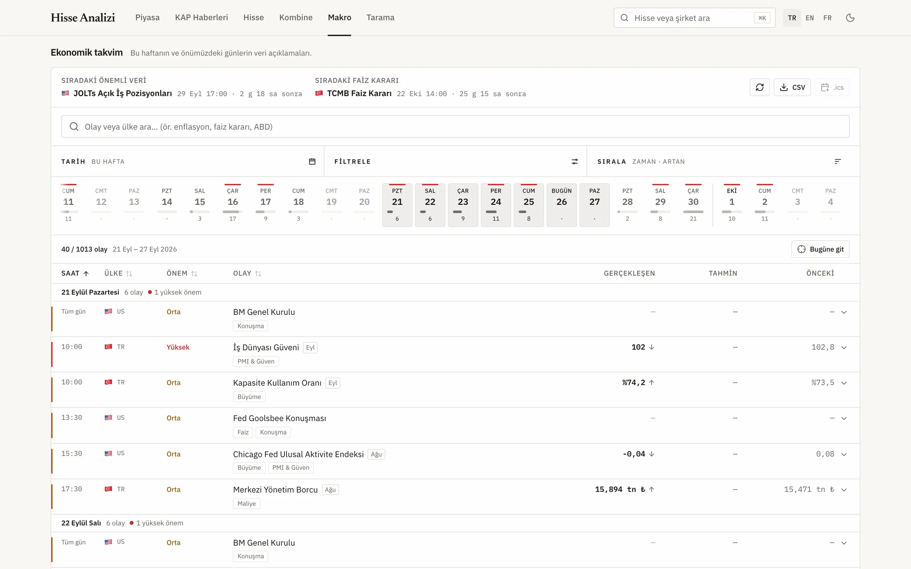
        </picture>
      </a>
      <p align="center"><sub>Ekonomik takvim: gerçekleşen, tahmin ve önceki değerler</sub></p>
    </td>
    <td width="50%" valign="top">
      <a href="https://hisse-analizi.duckdns.org/events">
        <picture>
          <source media="(prefers-color-scheme: dark)" srcset="docs/images/events-dark.webp">
          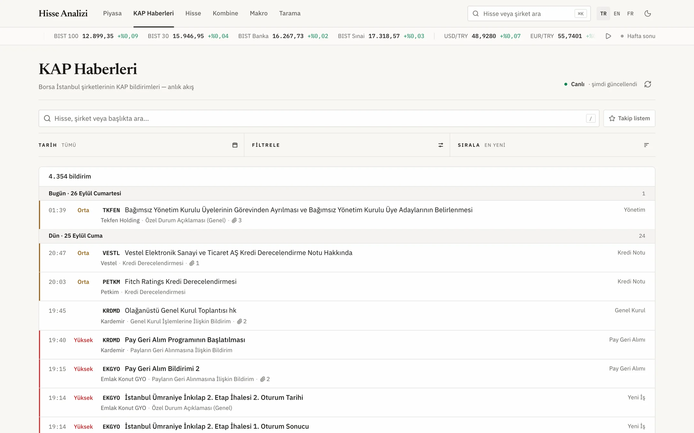
        </picture>
      </a>
      <p align="center"><sub>KAP haberleri: günlere göre gruplanan bildirim akışı</sub></p>
    </td>
  </tr>
</table>

<table>
  <tr>
    <td width="33%" valign="top">
      <a href="https://hisse-analizi.duckdns.org">
        <picture>
          <source media="(prefers-color-scheme: dark)" srcset="docs/images/phone-overview-dark.webp">
          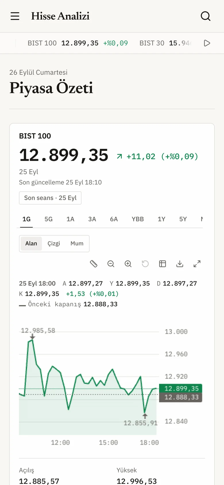
        </picture>
      </a>
    </td>
    <td width="33%" valign="top">
      <a href="https://hisse-analizi.duckdns.org/hisse/THYAO">
        <picture>
          <source media="(prefers-color-scheme: dark)" srcset="docs/images/phone-stock-dark.webp">
          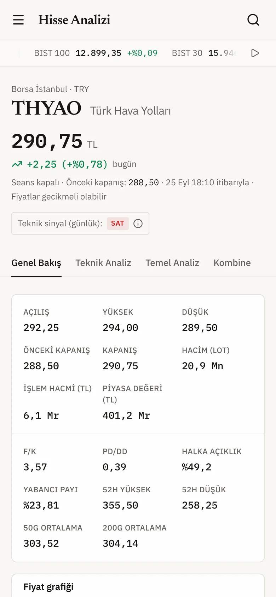
        </picture>
      </a>
    </td>
    <td width="33%" valign="top">
      <a href="https://hisse-analizi.duckdns.org/events">
        <picture>
          <source media="(prefers-color-scheme: dark)" srcset="docs/images/phone-events-dark.webp">
          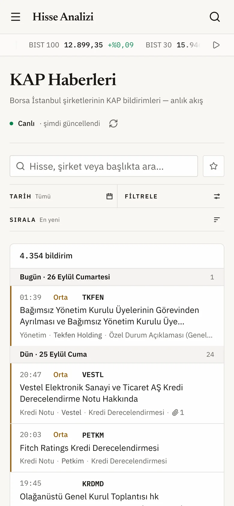
        </picture>
      </a>
    </td>
  </tr>
</table>
<p align="center"><sub>Telefonda piyasa özeti, hisse sayfası ve KAP akışı</sub></p>

## Veri kaynakları

Veriler PostgreSQL'de köken bilgisiyle (`source`, `fetched_at`, verinin kendi tarihi) saklanır ve **depo öncelikli** servis edilir: depo tazeyse oradan okunur, değilse canlı çekilip depoya yazılır; sağlayıcı yanıt vermezse son iyi kopya `stale: true` ile döner. Depo öncelikli uçların yanıtları (piyasa, teknik ve temel analiz, referans verileri, `/prices`, TCMB serileri) bir `meta` bloğu taşır: `source`, `source_url`, `as_of`, `fetched_at`, `age_seconds`, `served_from` (`live`, `store` veya `stale`), `stale`, `delay_seconds`, `notes`. Ayrıntılar: [docs/data-platform.md](./docs/data-platform.md).

| Veri | Birincil kaynak | Doğrulama / yedek |
|---|---|---|
| Şirket evreni (~630 hisse), endeks üyelikleri | Borsa İstanbul resmî bileşen dosyası, TradingView tarayıcısı, KAP şirket sayfaları (OID, sektör, pazar, halka açıklık) | İş Yatırım şirket kartı |
| Kotasyon (15 dk gecikmeli), günlük barlar | TradingView (tüm evren tek istekte; barlar bölünme düzeltmeli) | İş Yatırım `HisseTekil`/`OneEndeks` (resmî kapanış, TL ciro, AOF; kapanış mutabakatı) |
| Bilanço ve gelir tablosu | KAP finansal özet (ilk açıklanan, resmî) | İş Yatırım MaliTablo (çeyrekler; IAS 29 yeniden ifade katsayısıyla KAP bazına çevrilir) |
| Nakit akışı | İş Yatırım MaliTablo (KAP bazına çevrilir; bankalar için yok) | — |
| Oranlar (TTM ve yıllık) | Depodaki kanonik kalemlerden hesaplanır (`inputs_json` ile yeniden üretilebilir) | TradingView oranları (kalite kontrolü) |
| Temettü, sermaye artırımı, ortaklık yapısı, hedef fiyat, finansal rapor takvimi | İş Yatırım, KAP/MKK, hedeffiyat.com.tr, KAP beklenen bildirimler | — |
| Politika faizi ve koridor, TÜFE/ÜFE, döviz bülteni | TCMB sayfaları ve günlük kur XML'i (isteğe bağlı EVDS3) | borsapy, TradingView (kalite kontrolü) |
| Ekonomik takvim, tahvil, döviz ve emtia fiyatları | TradingView | doviz.com (takvim yedeği) |
| Şirket bildirimleri | KAP | — |
| Haberler | Google News RSS | — |

## Mimari

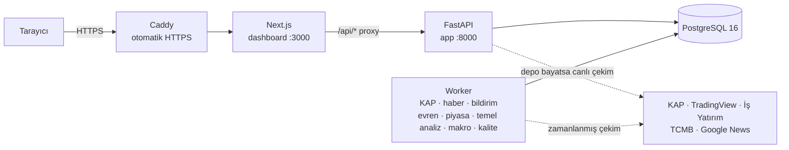
```mermaid
flowchart LR
    browser["Tarayıcı"] -- "HTTPS" --> caddy["Caddy<br/>otomatik HTTPS"]
    caddy --> web["Next.js<br/>dashboard :3000"]
    web -- "/api/* proxy" --> api["FastAPI<br/>app :8000"]
    api --> db[("PostgreSQL 16")]
    worker["Worker<br/>KAP · haber · bildirim<br/>evren · piyasa · temel analiz · makro · kalite"] --> db
    api -. "depo bayatsa canlı çekim" .-> sources["KAP · TradingView · İş Yatırım<br/>TCMB · Google News"]
    worker -. "zamanlanmış çekim" .-> sources
```

- Tarayıcı yalnızca Next.js ile konuşur; `/api/*` istekleri aynı origin üzerinden FastAPI'ye iletilir. Proxy yalnızca izin verilen başlıkları geçirir (çerez, `Authorization` ve `X-Admin-Key` iletilmez), yönetim uçlarını ve API dokümantasyonunu dışarı açmaz.
- Worker ayrı bir süreçtir ve tek replika çalışır. Veri platformu döngüleri (`reference`, `market`, `fundamentals`, `macro`, `quality`) her çalışmayı `ingestion_runs` tablosuna yazar; durum `GET /data/status`, kalite kontrolleri `GET /data/quality` ile izlenir. KAP kaynak taraması (advisory lock) ve bildirim outbox'ı (`FOR UPDATE SKIP LOCKED`) çoklu replikaya güvenlidir; haber ve veri platformu döngüleri değildir.
- Production'da dışarı yalnızca Caddy açıktır (80/443, HTTP/3 için 443/udp).

## Teknolojiler

| Katman | Kullanılanlar |
|---|---|
| Arayüz | Next.js 16 (App Router), React 19, TypeScript, Tailwind CSS 4, TanStack Query, TradingView Lightweight Charts, Recharts |
| API ve worker | Python 3.11+ (CI ve Docker imajı 3.12), FastAPI, Pydantic 2, SQLAlchemy 2 (async) ve asyncpg, slowapi, structlog |
| Veri | PostgreSQL 16, Alembic; kaynak erişimi için httpx, BeautifulSoup ve [borsapy](https://pypi.org/project/borsapy/) |
| Altyapı | Docker Compose, Caddy, GitHub Actions; canlı sürüm Oracle Cloud Always Free (Ampere A1) |

## Kurulum

Gereksinimler: Docker ve Docker Compose v2.

```bash
git clone https://github.com/bugraguclu/hisse-analizi-dashboard.git
cd hisse-analizi-dashboard
cp .env.example .env

# Servisleri başlatır; migration'lar migrate servisiyle otomatik çalışır
docker compose up --build -d
# Hisse evrenini ve veri kaynaklarını yükler; tekrar çalıştırılabilir
docker compose exec app python scripts/seed.py
```

| Servis | Adres |
|---|---|
| Arayüz | http://localhost:3000 |
| API | http://localhost:8000 |
| Swagger | http://localhost:8000/docs |
| Health / readiness | http://localhost:8000/health, `/health/ready` |

Seed, Borsa İstanbul'daki hisse evrenini (~630 hisse; BIST 100 çekirdek katmandır) ve veri kaynaklarını yükler. Grafik geçmişi, finansal tablolar ve makro seriler worker çalıştıkça depoya dolar; depo boşken API veriyi kaynaktan canlı çeker.

E-posta bildirimlerini denemek için MailHog: `docker compose --profile mail up -d mailhog` (arayüz: http://localhost:8025). Gönderimin MailHog'a gitmesi için `.env` içinde `SMTP_HOST=mailhog`, `SMTP_PORT=1025`, `SMTP_USE_TLS=false` ve `ENABLE_REAL_EMAIL=true` olmalıdır; varsayılan kuru çalıştırmadır, e-posta gönderilmez.

## Sunucuya kurulum

### Tek komutla

Boş bir Ubuntu 22.04 veya 24.04 sunucuda çalıştırın. Betik Oracle Cloud Always Free (Ampere A1) üzerinde denendi; 80 ve 443 portları dışarıya açık herhangi bir Ubuntu sunucuda da çalışır.

```bash
curl -fsSL -o setup.sh \
  https://raw.githubusercontent.com/bugraguclu/hisse-analizi-dashboard/master/deploy/setup-oracle.sh
bash setup.sh <alan-adı> [duckdns-token]
```

[`deploy/setup-oracle.sh`](./deploy/setup-oracle.sh) sırasıyla:

1. Docker'ı kurar, saat dilimini Europe/Istanbul yapar ve 80/443 portlarını sunucunun güvenlik duvarında açar (Oracle imajlarında kurallar `/etc/iptables/rules.v4` dosyasına yazılır, yeniden başlatmada korunur). Belleği 4 GB'tan az olan sunuculara takas alanı ekler.
2. DuckDNS token'ı verildiyse alan adını sunucunun IP adresine yönlendirir ve 5 dakikada bir günceller.
3. Depoyu `~/hisse-analizi-dashboard` altına klonlar ya da günceller. `.env` dosyasını ilk çalıştırmada rastgele veritabanı parolası ve `ADMIN_API_KEY` ile oluşturur; sonraki çalıştırmalarda bu değerler korunur.
4. Üretim yığınını derleyip başlatır, API hazır olunca seed'i çalıştırır.
5. Veritabanını her gece 04:30'da `~/backups` altına yedekleyen cron işini kurar (14 gün saklanır).

Betiğin yapamadığı iki adım var:

- Bulut sağlayıcının güvenlik duvarında TCP 80/443 ve UDP 443 için gelen trafiğe izin verin (Oracle Cloud'da VCN security list).
- DuckDNS kullanmıyorsanız alan adının A kaydı sunucuyu göstermelidir. Sertifika ilk istekte alınır.

Güncellemek için betiği depodaki kopyasından yeniden çalıştırın: `bash ~/hisse-analizi-dashboard/deploy/setup-oracle.sh <alan-adı>`. Kod `git pull --ff-only` ile güncellenir, imajlar yeniden derlenir, `.env` içindeki sırlar değişmez.

### Elle

Docker Compose v2.24+ gerekir (üretim katmanı `!reset` kullanır).

```bash
# .env içinde en az şunlar olmalı:
#   POSTGRES_PASSWORD, DOMAIN, CORS_ORIGINS=https://<DOMAIN>
#   ADMIN_API_KEY (en az 24 karakter; örn. openssl rand -hex 32)
docker compose -f docker-compose.yml -f docker-compose.prod.yml up -d --build
docker compose -f docker-compose.yml -f docker-compose.prod.yml exec app python scripts/seed.py
```

- Üretim katmanı `APP_ENV=production` ayarlar. Uygulama eksik veya 24 karakterden kısa `ADMIN_API_KEY`, zayıf veritabanı parolası ya da `*` CORS ile başlamayı reddeder.
- `DOMAIN` için DNS kaydı ilk başlatmadan önce sunucuyu göstermelidir. Caddy sertifikayı Let's Encrypt'ten alır ve kendisi yeniler; iletişim e-postası gerekmez.
- Dışarı yalnızca Caddy açılır. Veritabanı, API ve Next.js yalnızca compose ağında erişilebilir; API dışarıdan yalnızca `https://<DOMAIN>/api/...` üzerinden çağrılır, yönetim uçları ve Swagger dışarı açılmaz.
- Yedekleme: `scripts/backup.sh [dizin] [gün]` (gzip, zaman damgalı, varsayılan 14 gün saklama) ve `scripts/restore.sh`. Elle kurulumda gece yedeğini cron'a ekleyin.
- Yayından sonra `https://<DOMAIN>/api/health/ready`, ana sayfa, `/events` ve birkaç hisse sayfasını kontrol edin.

## Yapılandırma

Tüm ayarlar açıklamalarıyla [`.env.example`](./.env.example) dosyasındadır. Başlıcaları:

| Değişken | Açıklama |
|---|---|
| `APP_ENV`, `DOMAIN`, `POSTGRES_PASSWORD` | Ortam (`development`, `production`), Caddy'nin alan adı, veritabanı parolası |
| `DATABASE_URL`, `DATABASE_URL_SYNC` | PostgreSQL bağlantıları (async uygulama / Alembic) |
| `ADMIN_API_KEY` | `X-Admin-Key` ile korunan yönetim uç noktaları; production'da zorunlu |
| `CORS_ORIGINS` | İzin verilen origin'ler |
| `TRUSTED_PROXIES` | `X-Forwarded-For` başlığına güvenilen proxy adresleri (istemci bazlı oran sınırı) |
| `RATE_LIMIT_DEFAULT`, `RATE_LIMIT_ADMIN` | İstemci başına genel ve yönetim uç noktası sınırları |
| `SMTP_*`, `ENABLE_REAL_EMAIL` | İsteğe bağlı gerçek e-posta gönderimi (varsayılan: kuru çalıştırma) |
| `MARKET_*`, `FUNDAMENTALS_*`, `REFERENCE_*`, `MACRO_*`, `QUALITY_*` | Veri platformu: worker zamanlamaları, depo tazelik pencereleri, KAP/İş Yatırım istek aralıkları, kalite eşikleri (`MACRO_EVDS_API_KEY` ile EVDS3 açılır) |
| `API_URL`, `TRUSTED_PROXY_HOPS` | Next.js → FastAPI adresi ve Next.js önündeki proxy sayısı ([`dashboard/.env.example`](./dashboard/.env.example)) |

## Yerel geliştirme

Backend (PostgreSQL için `docker compose up -d db` yeterlidir):

```bash
python -m venv .venv
source .venv/bin/activate
python -m pip install -e ".[dev,email]"
cp .env.example .env
alembic upgrade head
python scripts/seed.py
uvicorn src.api.app:app --reload
python -m src.workers.run_workers    # ayrı terminalde, isteğe bağlı
```

Frontend:

```bash
cd dashboard
cp .env.example .env.local
npm ci
npm run dev
```

Docker ile çalışırken `docker compose -f docker-compose.yml -f docker-compose.dev.yml up -d` kaynak dizinlerini konteynerlere bağlar ve API'yi `--reload` ile başlatır; kod değişikliği için imajı yeniden derlemek gerekmez.

## Testler ve kontroller

```bash
ruff check src tests
mypy src
SKIP_NETWORK_TESTS=1 pytest -q

cd dashboard
npm run lint -- --max-warnings=0
npx tsc --noEmit
npm run build
npm audit --omit=dev --audit-level=high
```

`pg_session` fixture'ı ([`tests/conftest.py`](./tests/conftest.py)) gerçek PostgreSQL davranışını ayrı bir şemada test eder (`TEST_DATABASE_URL`, varsayılan `hisse_analizi_test`); veritabanı yoksa bu testler atlanır. Test veritabanını bir kez oluşturmak için: `docker compose exec db createdb -U hisse hisse_analizi_test`. CI aynı kontrollere ek olarak migration gidiş-dönüş testini (`upgrade → downgrade base → upgrade`), Compose doğrulamasını ve iki Docker imajının derlenmesini çalıştırır. Canlı sağlayıcı testleri `tests/integration` altındadır (`SKIP_NETWORK_TESTS=1` ile atlanır).

## API

OpenAPI sözleşmesi çalışma zamanında üretilir: Swagger `/docs`, ReDoc `/redoc`, JSON `/openapi.json` (yerelde; canlı sitede dışarı açık değildir).

- Uç nokta grupları: sistem ve arşiv (`/health`, `/stats`, `/companies`, `/events`, `/prices`, `/financials`), `/technical`, `/fundamentals`, `/market`, `/macro`, `/news`, `/data` ve `X-Admin-Key` ile korunan `/admin`, `/admin/data`, `/notifications`, `/outbox`.
- Hata yanıtları `{"detail": "<Türkçe mesaj>"}` biçimindedir; istek doğrulama hataları (422) FastAPI'nin varsayılan biçimini kullanır. Her yanıt `X-Request-ID` taşır.
- Geçersiz sembol 400, bilinmeyen sembol 404, veri sağlayıcı hatası 502/503 döner. `/events` toplam kayıt sayısını `X-Total-Count` başlığında verir.
- Depo öncelikli uçlar `meta` bloğu taşır (bkz. [Veri kaynakları](#veri-kaynakları)). `/prices` ve `/prices/latest` bunun özetini `X-Data-*` başlıklarında, `/financials` uçları tamamını `X-Data-Meta` başlığında da verir.
- `GET /companies` varsayılan olarak çekirdek katmanı (BIST 100) döner (`?tier=universe|all`, `?include_inactive=true`).
- `GET /data/status` veri kümesi bazında tazelik ve iş durumunu, `GET /data/quality` çapraz kaynak kontrol sonuçlarını verir; `POST /admin/data/refresh` ve `POST /admin/data/quality/run` yönetim tetikleyicileridir.

## Proje yapısı

```text
.
├── src/                  FastAPI uygulaması ve worker
│   ├── api/              router'lar, middleware, oran sınırı
│   ├── adapters/         veri kaynakları (KAP, TradingView, İş Yatırım, TCMB, Google News…)
│   ├── services/         iş mantığı (piyasa, temel analiz, makro, olaylar, kalite…)
│   ├── workers/          zamanlanmış döngüler
│   ├── db/               SQLAlchemy modelleri ve depolar
│   ├── schemas/          Pydantic şemaları
│   ├── parsers/          ayrıştırma yardımcıları
│   └── core/             ayarlar, loglama, zaman, meta bloğu
├── alembic/              veritabanı migration'ları
├── dashboard/            Next.js arayüzü
│   ├── src/app/          sayfalar (App Router) ve /api proxy'si
│   ├── src/components/   grafikler, hisse, makro, tarama ve KAP bileşenleri
│   └── src/lib/          API istemcisi, i18n, biçimlendirme
├── tests/                birim ve entegrasyon testleri (pytest)
├── scripts/              seed, yedekleme, geri yükleme ve bakım betikleri
├── deploy/               Caddyfile ve sunucu kurulum betiği
└── docs/                 veri platformu dokümanı ve README görselleri
```

## Bilinen sınırlar

- Piyasa verileri ücretsiz kaynaklardan gelir ve 15 dakika gecikmelidir; arayüz gecikmeyi belirtir.
- Haberler (Google News) yalnızca BIST 100 şirketleri için toplanır.
- Kullanıcı hesabı yoktur: site herkese açık, salt okunur bir analiz ekranıdır. Yönetim işlemleri anahtarla korunur; takip listeleri tarayıcıda saklanır.
- Worker tek replika çalışacak şekilde tasarlanmıştır (bkz. [Mimari](#mimari)).

Değişiklik geçmişi [CHANGELOG.md](./CHANGELOG.md), yönetici özeti [PROJE_OZETI.md](./PROJE_OZETI.md), veri platformu ayrıntıları [docs/data-platform.md](./docs/data-platform.md) dosyasındadır.

## Lisans

Bu depoda açık kaynak lisansı tanımlanmamıştır. Yeniden kullanım ve dağıtım için depo sahibinden izin alınmalıdır.
