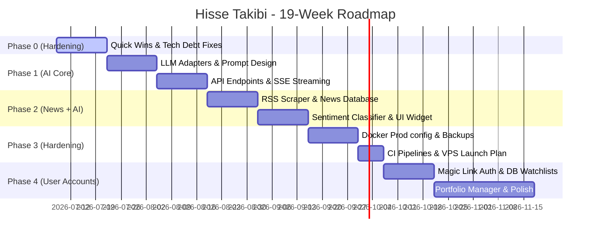

# Hisse Takibi — Launch Roadmap: Analysis & Delivery Plan

Welcome to the **Hisse Takibi** roadmap and development delivery plan. This document provides a detailed breakdown of where our stock analysis platform stands today, outlines a gap analysis against the project charter, and presents a structured, beginner-friendly roadmap for implementation. 

---

## 1. Where We Are Today (Gap Analysis)

This gap analysis compares the original project charter requirements against the actual verified state of the codebase in version `0.5.0` (as of July 2026). While the core data parsing and dashboard UI are extremely advanced, we currently have **zero AI integration**, **no user accounts/auth**, and **no production-ready CI/CD or monitoring**.

### Feature & Architecture Comparison

| Charter Feature / System Requirement | Verified Codebase State (v0.5.0) | Status | Details & Code References |
| :--- | :--- | :--- | :--- |
| **Data Ingestion Pipeline** | 15 adapter classes; background worker polls KAP, price, and financial data; PostgreSQL advisory locks and concurrency semaphores in place. | ✅ **Done & Exceeds** | Managed by [polling_worker.py](file:///Users/bugra/hisse-analizi-dashboard/src/workers/polling_worker.py) using [kap.py](file:///Users/bugra/hisse-analizi-dashboard/src/adapters/kap.py), [price.py](file:///Users/bugra/hisse-analizi-dashboard/src/adapters/price.py), and [financial_adapter.py](file:///Users/bugra/hisse-analizi-dashboard/src/adapters/financial_adapter.py). |
| **Technical Analysis** | Calculates 7 indicators (RSI, MACD, Bollinger Bands, SMA, EMA, SuperTrend, Stochastic Oscillator) across multiple timeframes. | ✅ **Done & Exceeds** | Located in [technical.py](file:///Users/bugra/hisse-analizi-dashboard/src/adapters/technical.py) and exposed via [routers_technical.py](file:///Users/bugra/hisse-analizi-dashboard/src/api/routers_technical.py). |
| **Fundamental Analysis** | Persists 8 ratios in the DB; live P/E ratios are supported. | ✅ **Done & Exceeds** | Located in [analysis_service.py](file:///Users/bugra/hisse-analizi-dashboard/src/services/analysis_service.py). Note: There is a pending share-count calculation TODO at [analysis_service.py:99](file:///Users/bugra/hisse-analizi-dashboard/src/services/analysis_service.py#L99). |
| **Market Screener & Scanner** | Multi-factor filtering (screener) and technical pattern matching (scanner) are fully implemented. | ✅ **Done & Exceeds** | Managed by [screener_adapter.py](file:///Users/bugra/hisse-analizi-dashboard/src/adapters/screener_adapter.py) and [scanner_adapter.py](file:///Users/bugra/hisse-analizi-dashboard/src/adapters/scanner_adapter.py). |
| **Macroeconomic Data** | Integration with TCMB (Central Bank of Turkey), inflation trends, currency rates, and economic calendar. | ✅ **Done & Exceeds** | Handled in [macro.py](file:///Users/bugra/hisse-analizi-dashboard/src/adapters/macro.py) and [routers_macro.py](file:///Users/bugra/hisse-analizi-dashboard/src/api/routers_macro.py). |
| **Dashboard Frontend** | Next.js 14 application with 8 pages (Technical, Fundamentals, Macro, Screener, Settings, etc.) styled with shadcn/ui and React Query. | ✅ **Done** | Located in [dashboard/](file:///Users/bugra/hisse-analizi-dashboard/dashboard) directory. |
| **AI Stock Commentary** | Interactive AI stock analysis report generated based on combined fundamental and technical indicators. | ❌ **Missing** | The UI button exists, but calls a non-existent `GET /ai/report/{ticker}`. Needs backend LLM service. |
| **Per-Stock Web News** | Gathering 48h news articles specifically related to each ticker. | ❌ **Missing** | Currently we only ingest announcements from KAP, but lack general web news tracking per ticker. |
| **AI News Interpretation** | Automatically determining news sentiment, potential market impact, and brief rationale using LLM. | ❌ **Missing** | Only basic keyword categorization exists in [event_service.py](file:///Users/bugra/hisse-analizi-dashboard/src/services/event_service.py). No LLM sentiment/impact routing. |
| **User Accounts & Auth** | Personal watchlists, user registration, profiles, and API access tiers. | ❌ **Missing** | Watchlists are currently saved in browser `localStorage`. No user tables or session management. |
| **CI/CD, Monitoring, backups**| Automated testing pipelines, production-grade Docker compose configurations, health checks, backups. | ❌ **Missing** | Currently uses basic development Docker Compose. No CI workflows or automated database backups. |

---

### Codebase Defects and Technical Debt to Resolve

Before writing new features, we must address these identified code issues in **Phase 0**:

1. **Frontend Swallows API Errors:** 
   In [api.ts](file:///Users/bugra/hisse-analizi-dashboard/dashboard/src/lib/api.ts#L24-L51), the `get` and `post` functions catch errors globally, log them using `console.error`, and return `null`. This prevents React Query from detecting failures, resulting in a UI that displays empty states (like "No data available") when the API is down, instead of showing a proper error page or retry option.
2. **Hardcoded API URLs:** 
   The frontend fallback `http://localhost:8000` is hardcoded across multiple files, including:
   - [Sidebar.tsx:75](file:///Users/bugra/hisse-analizi-dashboard/dashboard/src/components/layout/Sidebar.tsx#L75) (direct link to backend API Docs).
   - [api.ts:14](file:///Users/bugra/hisse-analizi-dashboard/dashboard/src/lib/api.ts#L14) (API URL base path).
   - [page.tsx:242](file:///Users/bugra/hisse-analizi-dashboard/dashboard/src/app/hisse/%5Bticker%5D/page.tsx#L242) (AI report button fetch request).
   - [next.config.ts:9](file:///Users/bugra/hisse-analizi-dashboard/dashboard/next.config.ts#L9) (Reverse proxy rewrites).
3. **Seed Script Limited to BIST 30:** 
   The database seed script in [seed.py](file:///Users/bugra/hisse-analizi-dashboard/scripts/seed.py#L19) only covers BIST 30 companies. We need to expand this to cover **BIST 100** so that the screener and scanner function across a broader market.
4. **`/admin/backfill` Endpoint Ignores Parameters:** 
   The backfill router in [routers.py:207](file:///Users/bugra/hisse-analizi-dashboard/src/api/routers.py#L207) accepts a `BackfillRequest` containing `days` and `source_code`, but calls `run_all_sources_once()`, which completely ignores the parameters and runs a generic poll.
5. **Unbounded TTL Cache in Backend:** 
   The `TTLCache` in [utils.py:24](file:///Users/bugra/hisse-analizi-dashboard/src/adapters/utils.py#L24) utilizes a simple python dictionary (`self._store: dict[str, tuple[float, Any]] = {}`). Entries are deleted only if they are queried and found to be expired. If a key is never fetched again, it remains in memory forever, leading to an unbounded memory footprint over time.
6. **Unbounded Thread Pools for Synchronous Offloading:** 
   The `run_sync` helper in [utils.py:135](file:///Users/bugra/hisse-analizi-dashboard/src/adapters/utils.py#L135) uses `asyncio.to_thread` to offload synchronous `borsapy` calls. In high-concurrency environments, this can trigger uncontrolled OS-level thread spawning.
7. **Version and Documentation Drift:** 
   The pyproject file states version `0.4.0`, whereas backend API schemas (e.g. `HealthOut` in [events.py:128](file:///Users/bugra/hisse-analizi-dashboard/src/schemas/events.py#L128)) claim version `0.5.0` and documents refer to v0.5.0.
8. **Dead Code Cleanup:** 
   Leftover company-specific scraping adapters:
   - [anadoluefes_news.py](file:///Users/bugra/hisse-analizi-dashboard/src/adapters/anadoluefes_news.py)
   - [anadoluefes_ir.py](file:///Users/bugra/hisse-analizi-dashboard/src/adapters/anadoluefes_ir.py)
   - Unused test fixtures like [anadoluefes_news_page.html](file:///Users/bugra/hisse-analizi-dashboard/tests/fixtures/anadoluefes_news_page.html).

---

## Phase 0 — Hardening & Quick Wins (Weeks 1–2)

### Why?
Adding AI analytics or multi-user accounts to a system that silently swallows errors, uses hardcoded local URLs, and leaks memory is highly risky. Before we write any AI code, we must ensure the core engine is robust, properly parameterized, and tested.

### Checklist & File References

*   **[x] Fix Frontend Error Swallowing:**
    *   **File:** [dashboard/src/lib/api.ts](file:///Users/bugra/hisse-analizi-dashboard/dashboard/src/lib/api.ts)
    *   **Action:** Modify `get` and `post` to throw descriptive errors (or return a discriminated union indicating failure status) rather than returning `null` when a response is not `ok` or a network error occurs. Update React Query hooks to display appropriate error screens.
*   **[x] Centralize Base API URLs:**
    *   **File:** [dashboard/src/lib/api.ts](file:///Users/bugra/hisse-analizi-dashboard/dashboard/src/lib/api.ts), [Sidebar.tsx](file:///Users/bugra/hisse-analizi-dashboard/dashboard/src/components/layout/Sidebar.tsx), [page.tsx](file:///Users/bugra/hisse-analizi-dashboard/dashboard/src/app/hisse/%5Bticker%5D/page.tsx)
    *   **Action:** Centralize the server URL endpoint configuration. Ensure all network requests utilize relative paths or the single centralized `NEXT_PUBLIC_API_URL` environment variable. Standardize `/api` Next.js rewrite or decide to delete the unused rewrite in [next.config.ts](file:///Users/bugra/hisse-analizi-dashboard/dashboard/next.config.ts) and call the centralized relative prefix.
*   **[x] Bound the Backend TTL Cache:**
    *   **File:** [src/adapters/utils.py](file:///Users/bugra/hisse-analizi-dashboard/src/adapters/utils.py)
    *   **Action:** Refactor `TTLCache` to enforce a maximum size limit (e.g., `max_size=1000` entries) using a Least Recently Used (LRU) eviction strategy (using a tracking structure like `collections.OrderedDict`).
*   **[x] Configure Thread Pool Limits:**
    *   **File:** [src/adapters/utils.py](file:///Users/bugra/hisse-analizi-dashboard/src/adapters/utils.py)
    *   **Action:** Define a custom, bounded thread pool executor for `run_sync` (e.g. using `concurrent.futures.ThreadPoolExecutor(max_workers=10)`) to limit resource consumption when executing synchronous dependencies.
*   **[x] Expand Seed Script to BIST 100:**
    *   **File:** [scripts/seed.py](file:///Users/bugra/hisse-analizi-dashboard/scripts/seed.py)
    *   **Action:** Add the full list of BIST 100 tickers and company names to `BIST30_COMPANIES` (renamed to `BIST100_COMPANIES`), enabling broader market tracking.
*   **[x] Fix `/admin/backfill` Parameter Handling:**
    *   **File:** [src/api/routers.py](file:///Users/bugra/hisse-analizi-dashboard/src/api/routers.py) and [src/workers/polling_worker.py](file:///Users/bugra/hisse-analizi-dashboard/src/workers/polling_worker.py)
    *   **Action:** Update the backfill runner method to accept `days` and `source_code` values, ensuring it only polls the selected source and queries the correct day ranges from the external APIs.
*   **[x] Upgrade `borsapy` to `>=0.10.2` & Run Tests:**
    *   **File:** [pyproject.toml](file:///Users/bugra/hisse-analizi-dashboard/pyproject.toml)
    *   **Action:** Upgrade `borsapy` to stable version `0.10.2` (enabling portfolio analysis and modern BIST feeds). Run the test runner using `pytest` to guarantee backwards compatibility.
*   **[x] Remove Dead Scraping Code:**
    *   **Action:** Delete company-specific scrapers: `src/adapters/anadoluefes_news.py`, `src/adapters/anadoluefes_ir.py`, and `tests/fixtures/anadoluefes_news_page.html`.
*   **[x] Clean up Version Mismatches:**
    *   **File:** [pyproject.toml](file:///Users/bugra/hisse-analizi-dashboard/pyproject.toml), [src/schemas/events.py](file:///Users/bugra/hisse-analizi-dashboard/src/schemas/events.py)
    *   **Action:** Standardize version names across files. Set everything to a consistent `0.5.0` or `0.5.1`.

### Sprint Checkout
*   **What you can do now:** You can run the dashboard completely separated from the host machine without CORS issues. Shutting down the API container displays an interactive error page in the UI rather than an empty page. The market screener contains all BIST 100 stocks. The backend runs without memory leakage or thread exhaustion.

---

## Phase 1 — AI Core (Weeks 3–6)

### Why?
This is the headline feature of the platform. We need to feed the database metrics (prices, financials, ratios, and technical signals) into Claude to generate structured Turkish analysis reports, while caching them using content hashes to keep LLM costs at a minimum.

### Architecture & LLM Cost Control Strategy

To prevent high API costs, we will use a **Generate-Once** model. We generate a report for a stock only when its input data changes.

```
                  ┌──────────────────────────────┐
                  │   Client Requests AI Report  │
                  └──────────────┬───────────────┘
                                 │ Ticker (e.g. THYAO)
                                 ▼
                  ┌──────────────────────────────┐
                  │ Gather: Technical, Financial │
                  │     & Price Data Snapshot    │
                  └──────────────┬───────────────┘
                                 │
                                 ▼
                  ┌──────────────────────────────┐
                  │ Compute SHA-256 Input Hash   │
                  └──────────────┬───────────────┘
                                 │
                                 ▼
                  ┌──────────────────────────────┐
                  │ Cache Check: Does DB have an │  YES  ┌────────────────────────┐
                  │   active report with this    ├──────►│ Return cached report   │
                  │         input hash?          │       │      (Takes <1s)       │
                  └──────────────┬───────────────┘       └────────────────────────┘
                                 │ NO
                                 ▼
                  ┌──────────────────────────────┐
                  │  Call Anthropic Claude API   │
                  └──────────────┬───────────────┘
                                 │ Streams back over SSE
                                 ▼
                  ┌──────────────────────────────┐
                  │ Save to DB: content_hash,    │
                  │ report_text, generated_at    │
                  └──────────────────────────────┘
```

*   **Models:**
    *   **`claude-3-5-sonnet`** (e.g. `claude-3-5-sonnet-20241022` or latest) ($3.00 per MTok input, $15.00 per MTok output) is utilized for the primary stock reports. Note that introductory pricing ($2.00 / $10.00) applies through August 31, 2026.
    *   **`claude-3-5-haiku`** ($1.00 per MTok input, $5.00 per MTok output) is utilized for fast text classifications.
*   **Prompt Caching:** We will cache the long, static Turkish system instructions (which contain formatting guidelines and SPK compliance rules). This reduces prompt ingestion costs by **80%+.**
*   **Daily Spending Limits:** Implementing a strict budget ceiling circuit breaker inside the client adapter to stop requests if spending exceeds $5.00/day.

### Checklist & File References

*   **[ ] Create LLM Client Adapter:**
    *   **File:** `[NEW]` [src/adapters/llm.py](file:///Users/bugra/hisse-analizi-dashboard/src/adapters/llm.py)
    *   **Action:** Implement the Anthropic client wrapper. Set up client connection pooling, error retries, prompt caching markers, cost calculation methods, and a daily spend circuit-breaker stored in Redis or memory.
*   **[ ] Define Database Schema & Migration 003:**
    *   **File:** `[NEW]` [alembic/versions/003_ai_reports.py](file:///Users/bugra/hisse-analizi-dashboard/alembic/versions/003_add_ai_reports_table.py)
    *   **Action:** Create the `ai_reports` table:
        ```sql
        CREATE TABLE ai_reports (
            id UUID PRIMARY KEY,
            company_id UUID REFERENCES companies(id) ON DELETE CASCADE,
            content_hash VARCHAR(64) UNIQUE NOT NULL, -- SHA-256 of combined data inputs
            report_text TEXT NOT NULL,
            generated_at TIMESTAMP WITH TIME ZONE NOT NULL,
            input_data_json JSONB NOT NULL
        );
        CREATE INDEX idx_ai_reports_company_hash ON ai_reports(company_id, content_hash);
        ```
*   **[ ] Write Turkish AI Report System Prompt:**
    *   **File:** `[NEW]` [src/services/prompts/report_tr.md](file:///Users/bugra/hisse-analizi-dashboard/src/services/prompts/report_tr.md)
    *   **Action:** Write the instruction template. Guidelines must dictate:
        1. Base analysis **exclusively** on the quantitative JSON context supplied (do not invent or recall numbers from memory).
        2. Embed SPK warning: *"Bu rapordaki analiz ve yorumlar yatırım tavsiyesi değildir (SPK Yatırım Danışmanlığı Tebliği uyarınca)."*
        3. Present technical indicator results strictly as data-readings (e.g. "RSI is high") rather than action signals like "Buy now".
*   **[ ] Implement AI Analysis Service:**
    *   **File:** `[NEW]` [src/services/ai_service.py](file:///Users/bugra/hisse-analizi-dashboard/src/services/ai_service.py)
    *   **Action:** Create `generate_report(ticker: str) -> str`. It gathers the stock details, technical signals, and income statement figures; compiles them into a JSON snapshot; generates a SHA-256 content hash; checks the database; and queries Claude if there is a cache miss.
*   **[ ] Create AI Report Router Endpoints:**
    *   **File:** `[NEW]` [src/api/routers_ai.py](file:///Users/bugra/hisse-analizi-dashboard/src/api/routers_ai.py)
    *   **Action:** Expose endpoints:
        *   `GET /ai/report/{ticker}`: Returns cached report or calls generation synchronously.
        *   `GET /ai/report/{ticker}/stream`: Streams report tokens using Server-Sent Events (SSE) for loading states.
        *   `POST /ai/report/{ticker}/regenerate`: Admin-only endpoint to clear cache and force fresh execution.
*   **[ ] Implement Nightly Batch Worker:**
    *   **File:** `[NEW]` [src/workers/ai_report_worker.py](file:///Users/bugra/hisse-analizi-dashboard/src/workers/ai_report_worker.py)
    *   **Action:** Run a nightly task querying the BIST 100. It computes hashes for each stock. If the hash differs from the saved DB report, it requests a new report. Use the **Anthropic Message Batches API** (runs asynchronously in the background and costs **50% less**).
*   **[ ] Optional: LLM KAP Event Classifier:**
    *   **File:** [src/services/event_service.py](file:///Users/bugra/hisse-analizi-dashboard/src/services/event_service.py)
    *   **Action:** Add flag-gated LLM processing inside event ingestion. Use `claude-3-5-haiku` to analyze incoming KAP event headers, categorizing their financial severity and impact. If disabled, fallback to simple keyword matching.

### Sprint Checkout
*   **What you can do now:** Click "AI Analiz Raporu" on a stock detail page. On the first click, you will see a typewriter-style Turkish stock commentary load via SSE in less than 10 seconds. Subsequent refreshes load the report instantly (<1 second) from the database cache. Nightly workers update the BIST 100 stock reports without generating expensive Claude API bills.

---

## Phase 2 — News + AI Interpretation (Weeks 7–10)

### Why?
Stock movements are not driven solely by past financial ratios. Breaking news and public updates drive short-term price movements. Adding news streams and using an LLM to classify sentiment and severity provides real-time market context.

### Checklist & File References

*   **[ ] Write Google News RSS Adapter:**
    *   **File:** `[NEW]` [src/adapters/news.py](file:///Users/bugra/hisse-analizi-dashboard/src/adapters/news.py)
    *   **Action:** Write a parser query to ingest RSS updates for specific tickers via Google News (compliant with terms of service: fetch headlines, URL source, published dates, and brief descriptions).
*   **[ ] Define News Database Schema & Migration 004:**
    *   **File:** `[NEW]` [alembic/versions/004_news_items.py](file:///Users/bugra/hisse-analizi-dashboard/alembic/versions/004_news_items.py)
    *   **Action:** Create the `news_items` database table:
        ```sql
        CREATE TABLE news_items (
            id UUID PRIMARY KEY,
            company_id UUID REFERENCES companies(id) ON DELETE CASCADE,
            title VARCHAR(512) NOT NULL,
            url VARCHAR(1024) UNIQUE NOT NULL, -- UNIQUE to prevent duplicate news
            snippet TEXT,
            published_at TIMESTAMP WITH TIME ZONE NOT NULL,
            sentiment VARCHAR(20),  -- 'pozitif', 'nötr', 'negatif'
            impact VARCHAR(20),     -- 'yüksek', 'orta', 'düşük'
            rationale VARCHAR(200),
            created_at TIMESTAMP WITH TIME ZONE DEFAULT CURRENT_TIMESTAMP
        );
        CREATE INDEX idx_news_published ON news_items(company_id, published_at DESC);
        ```
*   **[ ] Configure 15-Minute News Poll Loop:**
    *   **File:** [src/workers/polling_worker.py](file:///Users/bugra/hisse-analizi-dashboard/src/workers/polling_worker.py)
    *   **Action:** Register the news adapter into the system pool loop. Run news ingestion every 15 minutes for the active tickers, handling database upserts safely using `ON CONFLICT (url) DO NOTHING`.
*   **[ ] news API Router Endpoint:**
    *   **File:** `[NEW]` [src/api/routers_news.py](file:///Users/bugra/hisse-analizi-dashboard/src/api/routers_news.py)
    *   **Action:** Create `GET /news/{ticker}?hours=48`. Returns matching stock news from the database filtered by timeline.
*   **[ ] Implement AI News Classifier:**
    *   **File:** [src/services/ai_service.py](file:///Users/bugra/hisse-analizi-dashboard/src/services/ai_service.py)
    *   **Action:** Create `classify_news_batch(news_list)` using `claude-3-5-haiku` with JSON structured outputs to label news sentiment, market impact, and a short 200-character rationale.
*   **[ ] Feed News into AI Report Snapshot:**
    *   **File:** [src/services/ai_service.py](file:///Users/bugra/hisse-analizi-dashboard/src/services/ai_service.py)
    *   **Action:** Add summary statistics of the last 48 hours of news sentiment into the stock analysis snapshot. This guarantees that breaking news alters the data snapshot hash, triggering an automatic report refresh.
*   **[ ] Integrate News Section into Stock Detail Page:**
    *   **File:** [dashboard/src/app/hisse/[ticker]/page.tsx](file:///Users/bugra/hisse-analizi-dashboard/dashboard/src/app/hisse/%5Bticker%5D/page.tsx)
    *   **Action:** Build a news timeline UI widget showing headlines, dates, and sentiment badges (green for Pozitif, yellow for Nötr, red for Negatif) with tooltips displaying the AI rationale.

### Sprint Checkout
*   **What you can do now:** Open a stock's page (e.g., THYAO) and view recent news headlines loaded from Google News. Next to each headline, you will see a badge describing the sentiment and market impact. Clicking the badge reveals a short explanation of the classification. The stock analysis report will automatically mention these news events.

---

## Phase 3 — Production-like Hardening (Weeks 11–13)

### Why?
Our system currently runs in developer mode (exposed database ports, default root container credentials, etc.). Before deploying to a public VPS, we must secure our Docker containers, configure automatic database backups, set up GitHub actions, and limit API usage rates to prevent billing abuse.

### Checklist & File References

*   **[ ] Build Production-grade docker compose Configuration:**
    *   **File:** `[NEW]` [docker-compose.prod.yml](file:///Users/bugra/hisse-analizi-dashboard/docker-compose.prod.yml)
    *   **Action:** Configure production-grade deployments:
        *   Establish container restart policies (`restart: unless-stopped`).
        *   Add container healthcheck commands.
        *   Remove exposed database port bindings (ports should only be accessible internally within the docker network).
        *   Enforce memory limits (e.g. `mem_limit: 1g` for the FastAPI backend).
*   **[ ] Configure Secure Non-Root Container Execution:**
    *   **File:** [Dockerfile](file:///Users/bugra/hisse-analizi-dashboard/Dockerfile)
    *   **Action:** Modify the docker configuration to create a dedicated system user group and run the python processes using non-root privileges.
*   **[ ] Create Database Backup & Recovery Script:**
    *   **File:** `[NEW]` [scripts/backup.sh](file:///Users/bugra/hisse-analizi-dashboard/scripts/backup.sh)
    *   **Action:** Write a secure script to run nightly `pg_dump` commands, compress the output file, append timestamps, and retain the last 7 daily files. Document the restoration drill.
*   **[ ] Implement GitHub Actions CI Workflow:**
    *   **File:** `[NEW]` [.github/workflows/ci.yml](file:///Users/bugra/hisse-analizi-dashboard/.github/workflows/ci.yml)
    *   **Action:** Set up automated workflows running on every Pull Request to enforce code quality checks (`ruff check`, `mypy`), run unit tests with `pytest`, and build the Docker image.
*   **[ ] Secure Expensive AI Routes:**
    *   **File:** [src/api/app.py](file:///Users/bugra/hisse-analizi-dashboard/src/api/app.py) or [routers_ai.py](file:///Users/bugra/hisse-analizi-dashboard/src/api/routers_ai.py)
    *   **Action:** Tighten the rate limiting rules on the `/ai/*` routes (e.g. limit requests to 3 per minute per IP address) using `slowapi` decorators.
*   **[ ] Setup Sentry Error Monitoring (Optional):**
    *   **File:** [src/core/config.py](file:///Users/bugra/hisse-analizi-dashboard/src/core/config.py)
    *   **Action:** Add Sentry SDK integration to alert developers on backend crash events.

---

### When You Go Public: VPS Deployment Guide
This section provides instructions for launching **Hisse Takibi** on a public server. *Decision: Hosting on public server is deferred; keep this ready for Phase 2 checkout.*

#### 1. Hardware & Platform Selection
*   **Recommended:** A single virtual private server (VPS) from Hetzner, DigitalOcean, or Linode (€5.00 to €9.00/month).
    *   **Specifications:** 2 vCPUs, 2GB or 4GB RAM, 40GB SSD. This is sufficient to run the Next.js standalone server, FastAPI backend, PostgreSQL 16 DB, and workers.
*   **Alternative (PaaS):** Deploying the frontend to Vercel/Render, the backend to Railway, and database to Neon/Supabase.
    *   *Tradeoff:* Free tiers will quickly exceed bandwidth/db row limits; network latency between different hosts is higher; database connection pooling is more complex.

#### 2. Network & Reverse Proxy Architecture (Caddy Server)
Use **Caddy Server** as the primary gateway. Caddy handles automatic SSL certificate generation via Let's Encrypt.
*   Example `/etc/caddy/Caddyfile`:
    ```caddy
    hisse.domain.com {
        reverse_proxy /api/* backend:8000
        reverse_proxy * frontend:3000
    }
    ```

#### 3. Essential Legal Compliance (SPK & KVKK)
Before deploying the website publicly, the Turkish legal disclaimer pages must be published in the frontend router footer:
1.  **Yasal Sorumluluk Reddi (SPK Disclaimer):** Underlines that content does not constitute investment advice.
2.  **Kullanım Koşulları (Terms of Service):** Confirms that all data is provided strictly for educational and personal use.
3.  **KVKK / Çerez Politikası (GDPR Compliance):** Details user data encryption and cookie tracking.

---

## Phase 4 — Auth, Accounts & Polish (Weeks 14–19)

### Why?
Now that the platform is ready for public staging, users need to register, configure watchlists, track portfolios, and we need to limit quota costs on a per-user basis.

### Checklist & File References

*   **[ ] Build User Auth & Magic Link Sign-in:**
    *   **File:** `[NEW]` [src/db/models.py](file:///Users/bugra/hisse-analizi-dashboard/src/db/models.py) (add users table) and new auth router.
    *   **Action:** Implement passwordless email Magic Link authentication. Users enter their email address, receive a signed link containing a secure JWT token, and click it to authenticate.
*   **[ ] Migrate Watchlist to Server-Side DB:**
    *   **File:** [dashboard/src/components/watchlist](file:///Users/bugra/hisse-analizi-dashboard/dashboard/src/app/hisse/%5Bticker%5D/page.tsx)
    *   **Action:** Refactor watchlists. Instead of storing ticker arrays in the browser's `localStorage`, sync watchlists to the user's account database, allowing cross-device tracking.
*   **[ ] Configure User Resource Quotas:**
    *   **File:** [src/services/ai_service.py](file:///Users/bugra/hisse-analizi-dashboard/src/services/ai_service.py)
    *   **Action:** Add quota columns to the users table (e.g. `monthly_report_limit=5`). Restrict custom AI report generation requests if the limit is exceeded.
*   **[ ] Build User Portfolio Manager:**
    *   **File:** `[NEW]` [dashboard/src/app/portfoy](file:///Users/bugra/hisse-analizi-dashboard/dashboard)
    *   **Action:** Implement user portfolio tracking utilizing the custom `Portfolio` module in `borsapy 0.10.x` to calculate and graph real-time stock cost averages, profit/loss margins, and valuations.
*   **[ ] EVDS Macro Ingestion Upgrade:**
    *   **File:** [src/adapters/macro.py](file:///Users/bugra/hisse-analizi-dashboard/src/adapters/macro.py)
    *   **Action:** Request a TCMB EVDS API key. Expand macroeconomic tracking indicators from the basic default list to a detailed database covering 145 categories.
*   **[ ] Interface Polish, Accessibility (a11y) & i18n:**
    *   **Action:** Consolidate localized strings, fix broken Turkish diacritics in labels, sync the root `<html lang="tr">` attributes, and add keyboard focus traps for modals and navigation elements.

### Sprint Checkout
*   **What you can do now:** Visit the homepage and register using your email. Check your inbox, click the magic login link, and access your dashboard. Your stock watchlist persists across different browsers and devices. You can register stock buy/sell transactions on a portfolio screen and view interactive performance graphs.

---

## Future / v1.0 Note (Monetization & BIST Licensing)

Hisse Takibi is built as a personal, free tool utilizing `borsapy` for personal/educational purposes. If the founders decide to monetize the tool in the future:

> [!WARNING]
> **Commercial distribution of Borsa İstanbul (BIST) stock market feed data requires a licensing agreement with Borsa İstanbul.**
> Distributing real-time or delayed BIST data via a paid dashboard without paying exchange vendor fees is a breach of exchange regulations.

### Potential Business Paths to Monetize:
1.  **Raw Data Licensing:** Contact Borsa İstanbul Data Licensing Sales to pay corporate data redistribution fees.
2.  **Charge for AI/Analytics Layer Only:** Do not distribute raw tables or price feeds. Instead, position the platform as a paid personal utility tool where users enter their own stock positions, and charge exclusively for the AI analytics reports.
3.  **Referral/Brokerage Integration:** Partner with a licensed financial broker to generate commissions on trade routing.

---

## Supporting Sections

### Risk Register & Mitigation Strategy

*   **Risk 1: Financial Advice Liability (SPK Regulations)**
    *   *Severity:* Critical.
    *   *Detail:* AI reports could be flagged as illegal financial advice (SPK Yatırım Danışmanlığı).
    *   *Mitigation:* Prepend and append clear legal disclaimers. In the system prompt, instruct the model to use neutral analytical language (e.g., "RSI is in overbought territory" rather than "Sell this stock immediately").
*   **Risk 2: AI Financial Hallucinations**
    *   *Severity:* High.
    *   *Detail:* Generative LLMs are prone to making up figures (e.g. fabricating a company's debt ratio).
    *   *Mitigation:* Do not allow Claude to retrieve external web data. Supply all financial numbers strictly as JSON variables inside the prompt, and enforce parser validation to flag discrepancies.
*   **Risk 3: Scraping Source Instability**
    *   *Severity:* High.
    *   *Detail:* Google News RSS or BIST feeds changing layout can break data ingestion.
    *   *Mitigation:* Pin library dependencies (`borsapy`, `beautifulsoup4`). Keep keyword fallbacks and alert notifications in the outbox queue if polling fail-counts trigger limits.
*   **Risk 4: Anthropic Claude Sonnet Pricing Changes**
    *   *Severity:* Medium.
    *   *Detail:* Claude Sonnet's introductory pricing ($2.00 / $10.00) expires on August 31, 2026.
    *   *Mitigation:* Prepare fallback configuration variables to route simpler summaries to `claude-3-5-haiku` to keep operational cost limits secure.

---

### Monthly Project Operating Cost Estimates

| Item Category | Free / Developer Mode | Public Production Mode | Details |
| :--- | :--- | :--- | :--- |
| **Hosting Server** | $0.00 (Local Docker) | $6.00 (Hetzner VPS) | 2 vCPU, 2GB RAM. |
| **Domain Registration** | $0.00 | $1.00 | Custom domain name registrar. |
| **Claude API - Reports** | $5.00 – $15.00 | $10.00 – $30.00 | Based on Sonnet prompt caching and caching. |
| **Claude API - News Classification** | $1.00 | $2.00 – $5.00 | Handled by Claude Haiku in batch formats. |
| **Google News RSS** | $0.00 | $0.00 | Ingested via RSS XML feed. |
| **TCMB EVDS Macro Key** | $0.00 | $0.00 | Personal developer API key (free). |
| **BIST Data Licensing** | $0.00 (Personal use) | Deferred | Requires commercial corporate licensing. |
| **Total Monthly Cost** | **$6.00 – $16.00** | **$19.00 – $42.00** | Highly cost-efficient, beginner budget. |

---

### Sprint Schedule (2-Week Deliverables)



---

## Glossary of Terms

*   **Server-Sent Events (SSE):** A server push technology enabling a client to receive automatic, real-time updates from a server over an HTTP connection. Used in this project to stream AI report paragraphs to the dashboard in real-time.
*   **Prompt Caching:** An optimization technique where the LLM provider caches static prompt prefixes. This reduces processing time and cuts input cost rates by up to 80% on long instruction templates.
*   **Content Hashing (SHA-256):** Generating a unique alphanumeric fingerprint based on input data content. We use this to compare if stock financial numbers have changed since the last generated AI report.
*   **Outbox Pattern:** A reliable software pattern where message deliveries (like email alerts) are first saved into a database table (`outbox_entries`) inside the same transaction, and then processed asynchronously by a worker daemon to guarantee delivery.
*   **Advisory Locks:** Cooperative lock mechanisms in PostgreSQL. In this project, polling workers request advisory locks to coordinate execution and prevent multiple server containers from scraping the same source simultaneously.
*   **Magic Link:** A form of passwordless authentication where a secure, short-lived login link containing a JWT token is emailed to the user, bypassing password management.
*   **EVDS (Elektronik Veri Dağıtım Sistemi):** The macroeconomic data distribution system managed by the Central Bank of Turkey (TCMB).
