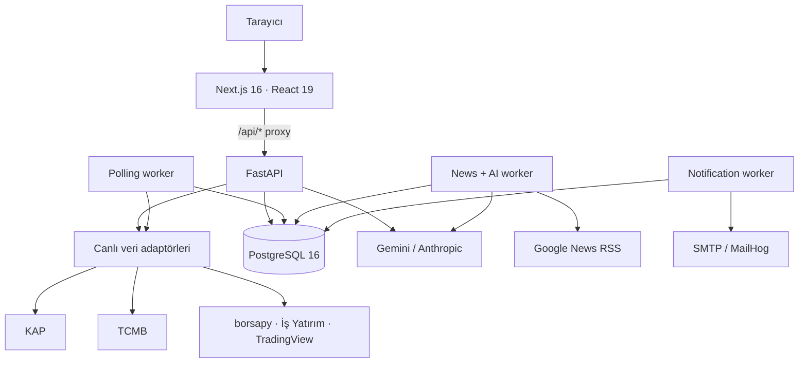
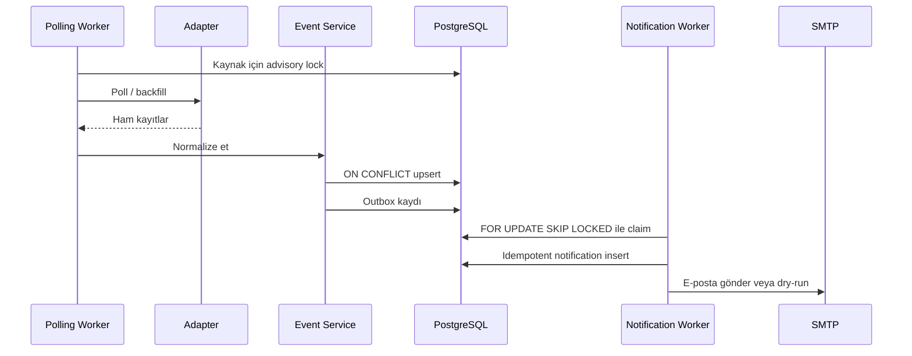
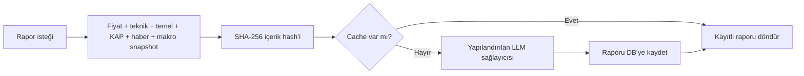

# Sistem Mimarisi

Bu belge Hisse Analizi Dashboard `v0.8.0` bileşenlerini, veri akışlarını ve yayın sınırlarını özetler. Komutlar için ana [README](../README.md), endpoint sözleşmesi için [API Rehberi](./api-rehberi.md) kullanılmalıdır.

## Genel görünüm



Sistem iki veri yolu kullanır:

1. **İstek anında canlı veri:** Fiyat, teknik gösterge, temel veri, tarama ve makro endpoint’leri adaptörleri çağırır; kısa TTL cache ile dış sağlayıcı yükü sınırlandırılır.
2. **Kalıcı/işlenmiş veri:** KAP olayları, fiyat kayıtları, finansallar, haberler, AI raporları ve bildirimler worker’lar tarafından PostgreSQL’e yazılır.

Bu ayrım nedeniyle PostgreSQL çalışmasa bile bazı canlı analiz endpoint’leri kullanılabilir; olay arşivi, sistem sayaçları, haber sınıflandırmaları ve AI rapor cache’i DB’ye bağlıdır.

## Katmanlar

| Katman | Konum | Sorumluluk |
|---|---|---|
| Web | `dashboard/src/app`, `dashboard/src/components` | Sayfalar, grafikler, tablolar, kullanıcı durumları ve API proxy |
| API | `src/api` | HTTP sözleşmesi, doğrulama, rate limit, CORS ve admin auth |
| Adaptör | `src/adapters` | KAP, piyasa, makro, haber ve LLM sağlayıcı entegrasyonları |
| Servis | `src/services` | Normalizasyon, finansal oranlar, AI snapshot/cache ve bildirim kuralları |
| Veri | `src/db`, `alembic` | SQLAlchemy modelleri, atomik repository işlemleri ve migration’lar |
| Worker | `src/workers` | Zamanlanmış veri toplama, haber sınıflandırma ve outbox tüketimi |

## Frontend istek yolu

Tarayıcı varsayılan olarak backend adresini doğrudan bilmez:

```text
Browser → /api/market/search?q=THYAO
        → Next.js route handler
        → API_URL/market/search?q=THYAO
        → FastAPI
```

Bu model CORS ihtiyacını azaltır ve Docker’daki `app:8000` servis adının browser bundle’ına girmesini engeller. Ayrı-origin deployment gerekiyorsa `NEXT_PUBLIC_API_URL` açıkça yapılandırılabilir; gizli anahtarlar hiçbir zaman `NEXT_PUBLIC_*` alanlarına yazılmamalıdır.

## Canlı veri adaptörleri

| Adaptör grubu | Veri | Cache yaklaşımı |
|---|---|---|
| `fundamentals.py` | KAP tabloları, şirket bilgisi, temettü, ortaklık, hedef fiyat | Finansal/veri türüne göre kısa TTL |
| `technical.py` | RSI, MACD, Bollinger, SMA/EMA, SuperTrend, Stochastic, pivot | Kısa TTL; sync sağlayıcı bounded executor üzerinden |
| `screener_adapter.py` / `scanner_adapter.py` | Temel filtre ve teknik sinyal taraması | Normalize edilmiş filtre sözleşmesi |
| `index_adapter.py` / `stream_adapter.py` | Endeks, geçmiş fiyat ve snapshot | Sınırlı eşzamanlılık, retry ve periyot eşleme |
| `macro.py` | TCMB faiz, enflasyon, FX ve takvim | En güncel kayıt/tarih seçimi |
| `search_adapter.py` | İşlem gören BIST payları | BIST + stock kapsam filtresi |
| `llm.py` | Gemini/Anthropic rapor üretimi | Günlük bütçe sayacı ve rapor içerik hash’i |

Adaptör hataları uygun endpoint’lerde `502` olarak görünür. Arayüz bu durumları “veri yok” diye gizlemek yerine hata ve tekrar deneme durumu gösterir.

## Kalıcı veri akışı



Başlıca tablolar:

- `companies`, `sources`, `polling_states`
- `raw_events`, `normalized_events`
- `price_data`, `financial_statements`, `financial_ratios`
- `event_outbox`, `notifications`, `notification_rules`
- `ai_reports`, `news_items`

## AI rapor akışı



AI anahtarı yoksa sistemin geri kalanı etkilenmez. AI endpoint’leri açıklayıcı `503`; günlük bütçe aşıldığında `429` döndürür. Rapor prompt’u yalnızca snapshot içindeki kanıtlara dayanmayı ve yatırım tavsiyesi üretmemeyi zorunlu kılar.

## Güvenlik ve dayanıklılık

| Risk | Kontrol |
|---|---|
| Yetkisiz yönetim çağrısı | `/admin/*` için `X-Admin-Key` |
| İstenmeyen origin | Yapılandırılabilir CORS allowlist |
| Aşırı istek | Genel, admin, pahalı ve AI endpoint’leri için ayrı rate limit |
| Geçersiz sembol | Ortak ticker doğrulaması |
| Çift kayıt/bildirim | PostgreSQL unique constraint + `ON CONFLICT` |
| Worker yarışları | Advisory lock, semaphore, outbox claim |
| E-posta header enjeksiyonu | CR/LF sanitizasyonu |
| Eski/yanlış veri | Kaynak/dönem metadata’sı, veri kalite testleri, hata durumunu gizlememe |
| Secret sızıntısı | `.env` ignore, server-only `API_URL`, production fail-fast |

## Deployment topolojisi

Ana Compose dosyası şu servisleri tanımlar:

| Servis | İşlev | Dış port |
|---|---|---|
| `dashboard` | Next.js web | `3000` |
| `app` | FastAPI | `8000` |
| `worker` | Polling/news/notification zamanlayıcıları | Yok |
| `db` | PostgreSQL 16 | `5432` (yerel geliştirme) |
| `mailhog` | İsteğe bağlı e-posta test servisi | `1025`, `8025` |

Production’da veritabanı portu internete açılmamalı; TLS/reverse proxy, yedekleme, log yönetimi ve gözlemlenebilirlik platform katmanında sağlanmalıdır. Güvenli başlangıç için worker tek replica çalıştırılmalıdır.

## Tasarım sınırları

- Cache process-local’dır; birden fazla API replica’sında ortak cache garantisi yoktur.
- Haricî sağlayıcı sözleşmeleri değişebilir; adaptörler 502 ve kullanıcıya görünür hata ile başarısız olur.
- Uygulama gerçek zamanlı işlem terminali değildir; polling ve cache gecikmeleri vardır.
- Kullanıcı hesabı/sunucu taraflı portföy yoktur; takip listesi browser tarafındadır.
